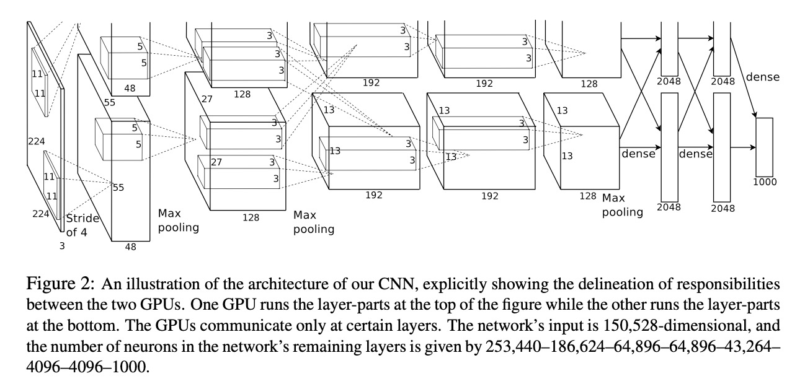
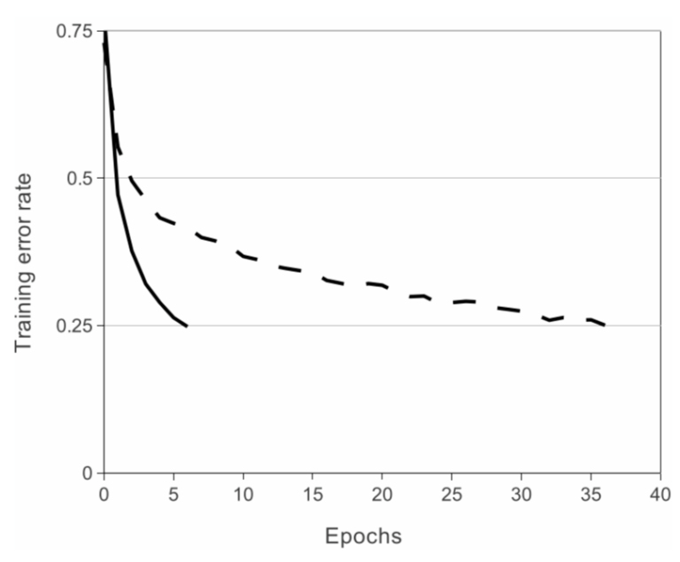

# AlexNet

### Paper: [ImageNet Classification with Deep Convolutional Neural Networks](https://github.com/YYingH/CNN_Pytorch_Implementation/blob/master/AlexNet/img/AlexNet.pdf)

**5 Convolutional Layers** and **3 Fully Connected Layers**.

Multiple Convolutional layers extract interesting features in an image. The Overlapping Max Pooling layers are followed by the first two convolutional layers and directly connect to the fourth and fifth convolutional layers. The fifth convolutional layer is followed by an Overlapping Max Pooling layer, the output of which goes into a series of two fully connected layers. The second fully connected layer feeds into a softmax classifier. ReLU nonlinearity is applied after all the convolution and fully connected layers. The ReLU nonlinearity of the first and second convolution layers are followed by a local normalization step before doing pooling. But researchers later didn’t find normalization very useful. 

**Overalpping Max Pooling**

Max Pooling layers are usually used to downsample the width and height of the tensors, keeping the depth same. Overlapping Max Pool layers are similar to the Max Pool layers, except the adjacent windows over which the max is computed overlap each other. 

**ReLU Nonlineariity**

An important feature of the AlexNet is the use of ReLU(Rectified Linear Unit) Nonlinearity. Tanh or sigmoid activation functions used to be the usual way to train a neural network model. AlexNet showed that using ReLU nonlinearity, deep CNNs could be trained much faster than using the saturating activation functions like tanh or sigmoid. The figure below from the paper shows that using ReLUs(solid curve), AlexNet could achieve a 25% training error rate six times faster than an equivalent network using tanh(dotted curve) on CIFAR-10 dataset.

