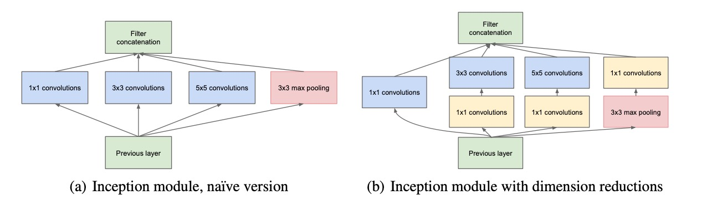
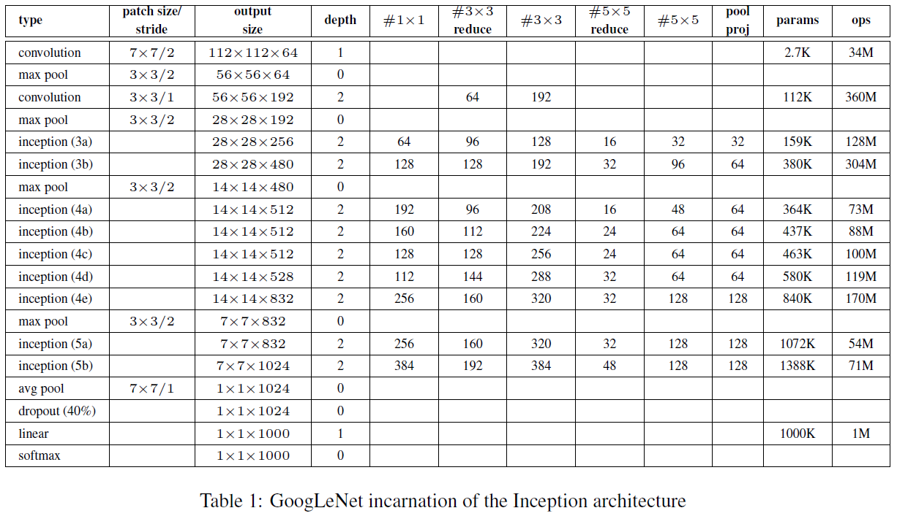
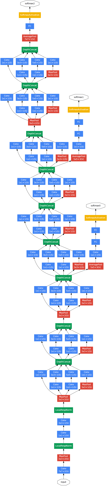

# GoogLeNet
GoogLeNet

### 1 x 1 convolutional layer

In GoogLeNet, the author applied additional 1 x 1 convolutional layers followed typically by the rectified linear activation structure for two reasons:

- It can be considered as dimension reduction model to remove computational bottlenects, which would limit the network size.

- Help to increase the depth and width of network without significanat performance penalty.

### increase the size of network

The author also discusses drawbacks of increase the size of network, icludes both depth and width, which is the most common way of improving the network performances. Bigger size, on the one hand, typically means a larger number of parameters, which makes the enlarged network more prone to overfitting, especially if the number of labeled examples in the training set is limited. On the other hand, another drawback of uniformly increased network size is the dramatically increased use of computional resources. The author said, the fundamental way of solving these issues would be ultimately moving from fully connected to sparsely connected architectures, even inside the convolutions. Then they involved Inception architecture to build the neural network.

### Inception details

The main idea of Inception architecture is based on finding out how an optimal local sparse structure in a convolutional vision network can be approximated and covered by readily available dense components. In the lower layers(the ones close to the input) correlated units would concentrate in local regions. Start using Inception modules only at higher layers while keeping the lower layers in traditional convolutional structure.

1. Using convolution kernels of different sizes means different receptive fields, and the final stitching means the fusion of features at different scales

2. The reason for using convolution sizes of 1, 3, and 5 is mainly to facilitate alignment. After setting the convolution step size stride = 1, as long as padding = 0, 1, 2, respectively, the height and width can be guaranteed to be the same after convolution, and then these features are stacked together according to the Channel

3. The article says that many places show that Pooling is very effective, so Inception is also embedded

4. The later the network is, the more abstract the features are, and the receptive fields involved in each feature are also larger. Therefore, as the number of layers increases, the proportion of 3 × 3 and 5 × 5 convolution kernels also increases. However, using a 5 × 5 convolution kernel still brings a huge amount of calculations. To this end, the paper draws on the NiN structure and uses a 1 × 1 convolution kernel to reduce the dimensions.

For example, the output of the previous layer is 100 × 100 × 128. After a 5 × 5 convolution layer with 256 outputs (stride = 1, padding = 2), the output dimension is 100 × 100 × 256. Among them, the convolution The parameters of the layer are 128 × 5 × 5 × 256. If the output of the previous layer first passes through a 1 × 1 convolution layer with 32 outputs, and then passes through a 5 × 5 convolution layer with 256 outputs, the final output data is still 100 × 100 × 256, but the convolution parameters The amount has been reduced to 128 × 1 × 1 × 32 + 32 × 5 × 5 × 256, which has been reduced by about 4 times.

### GoogLeNet

The name GoogLeNet is a homage to Yann LeCuns' LeNet-5 network.

GoogLeNet with Inception architecture is shown below:

#### The overall structure:

1. All convolutions, including the Inception module, use the ReLU activation function

2. The size of the input image is 3 × 224 × 224, and the mean is subtracted for all three RGB channels

3. **\# 3 × 3 reduce** and **\# 5 × 5 reduce** represent the number of 1 × 1 convolution kernels used by the dimensionality reduction before 3 × 3 and 5 × 5 convolution, respectively; **pool proj** represents the number of 1 × 1 convolution kernels used after max-pooling. All of these dimension reduction / projection layers also use ReLU.

4. The network contains 22 layers with parameters (27 if pooling is considered), and there are about 100 layers in total.

5. The features generated by the layers in the middle of the network will be very distinguishable, adding some auxiliary classifiers to these layers. These classifiers are placed on the outputs of Inception (4a) and Inception (4b) as small convolutional networks. During training, the losses are superimposed on the total loss based on the discounted weight (discount weight 0.3)

#### Specific details of the auxiliary classifier:

1. An average pooling layer with 5×5 filter size and stride 3, resulting in an 4×4×512 output
for the (4a), and 4×4×528 for the (4d) stage.

2. A 1×1 convolution with 128 filters for dimension reduction and rectified linear activation.

3. A fully connected layer with 1024 units and rectified linear activation.
4. A dropout layer with 70% ratio of dropped outputs.
5. A linear layer with softmax loss as the classifier (predicting the same 1000 classes as the main classifier, but removed at inference time).

#### The final network model is shown below:

