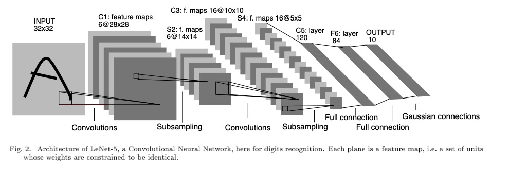

# LeNet-5

INPUT: [28x28x1]           weights: 0

CONV5-32: [28x28x32]       weights: (5 * 5 * 1 + 1) * 32

POOL2: [14x14x32]          weights: 2 * 2 * 1

CONV5-64: [14x14x64]       weights: (5 * 5 * 32 + 1) * 64

POOL2: [7x7x64]            weights: 2 * 2 * 1

FC: [1x1x1024]              weights: (7 * 7 * 64 + 1) * 1024

FC: [1x1x10]              weights: (1 * 1 * 512 + 1) * 10

Convolution: $$Size_{out} = (Size_{in} - Kernel_{Pooling} + 2 * Padding)/Stride + 1$$

Pooling: $$Size_{out} = (Size_{in} - Kernel_{Pooling})/Stride + 1$$

Implement the LeNet using Pytorch to recognize handwritten number. Training with MNIST.

1. Training with MNIST set with image size 28 * 28.
2. To match the size of LeNet, the first convolution layer applied padding.
3. Using Relu instead of Sigmod as activation function.

This net can get 97.85% correct rate on MNIST test set.

