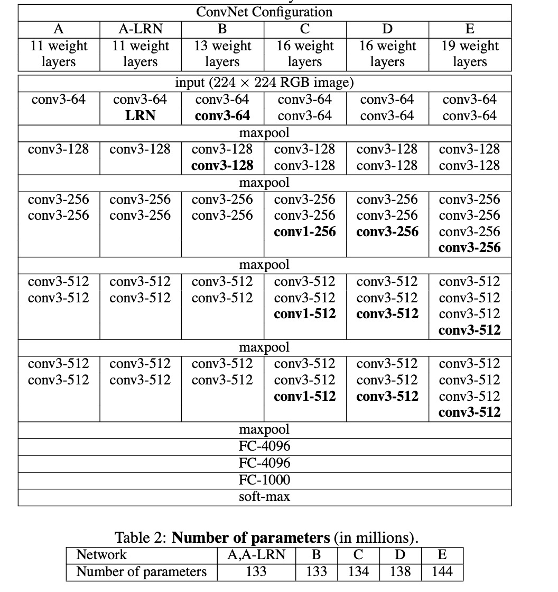

# VGG
Pytorch-VGG

### Paper: [Very Deep Convolutional Networks For Large-scale Image Recognition]

input size: 224 x 224;

the receptive field size is 3 x 3;

the convolution stride is 1 pixel;

the padding is 1 (for receptive field of 3 x 3) so we keep the same spatial resolution;

the max pooling is 2 x 2 with stride of 2 pixels;

there are two fully connected layers with 4096 units each;

the last layer is a softmax classification layer with 1000 units (representing the 1000 ImageNet classes);

the activation function is the ReLU

### Main Points:

- Only use 3x3 sized filters as the combination of two 3x3 conv layers has an effective receptive field of 5x5. Another benefits is small filters could help to decrease the number of parameters. 

- 3 conv layers back to back have an effective receptive field of 7x7.

- As the spacial size of the input volumes at each layer decreases, the depth of the volumes increase due to the increased number of filters as you go down the network.

- The number of filters doubles after each maxpool layer. This reiforces the idea of shrinking spatial dimensions, but growing depth.

- Work well on both classification and localization tasks.

- Used scale jittering as one data augmentation technique during training.

- initialisation of the network weight is important. When training deeper architectures, the author initialised the first four convolutional layers and the last three fully-connected layers with the layers of net A. They also didn't decrease the learning rate for the pre-initialised layers.

- The input images were randomly cropped from rescaled training images (one crop per image per SGD iteration). To further augment the training set, the crops underwent random horizontal flipping and random RGB colour shift. 

- The crop size is fixed to 224x224. Let S be the smallest side of a isotropically-rescaled training image. In principle S can take on any value not less than 224: for S = 224 the crop will capture whole-image statistics, completely spanning the smallest side of a training image; for S >= 224, the crop will correspond to a small part of the image, containing a small object or an object part.

**Advantages of 3x3 filter**

1. The amount of parameters is smaller.

2. Small conv layers have more linear transformations than large ones, also improve the network's learning ability.

**Advantages of 1x1 filter**

1. The effect is to linearly deform the input without affecting the input and output dimensions, and then perform nonlinear processing through Relu to increase the network's nonlinear expression ability.

2. Dimensionality reduction.

